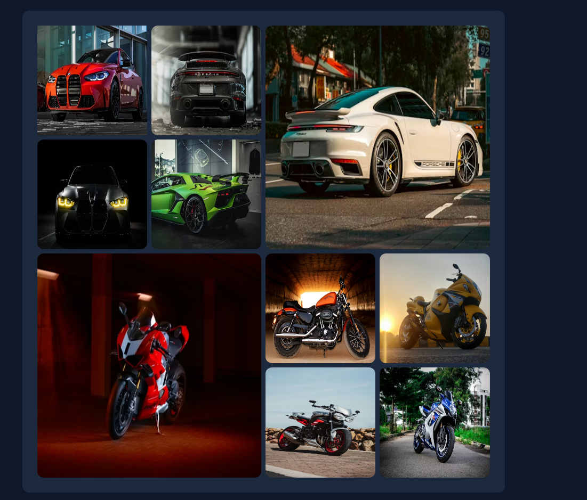

# Grid Gallery 

A **professional responsive image gallery** built using **HTML5** and **Tailwind CSS**.
This project demonstrates how to create a clean and modern **grid-based layout** with featured images and a dark user interface.

The gallery showcases vehicle images arranged in a structured layout using Tailwind's grid utilities.

---

## 📌 Overview

This project is a simple and elegant **image grid gallery** designed with modern UI practices.

It uses:

* Responsive Grid Layout
* Dark Theme Interface
* Tailwind Utility Classes
* Structured Image Placement

The design focuses on **simplicity, readability, and modern layout techniques.**

---

## ✨ Features

* Responsive grid layout
* Clean and modern design
* Dark user interface
* Featured large images
* Rounded corners
* Structured spacing
* Lightweight implementation
* Beginner friendly

---

## 🛠 Built With

* **HTML5**
* **Tailwind CSS (CDN)**

Tailwind CDN used:

```
https://cdn.jsdelivr.net/npm/@tailwindcss/browser@4
```

---



[LIVE](https://liveabhi009.github.io/Grid-Gallery/)


## 📁 Project Structure

```
grid-gallery/
│
├── index.html
└── README.md
```

---

## 🎨 Design Details

### Theme

Dark modern interface.

| Element    | Style      |
| ---------- | ---------- |
| Background | Slate 900  |
| Container  | Slate 800  |
| Text       | White      |
| Corners    | Rounded XL |

---

## 📐 Layout

The gallery uses a **4-column CSS Grid layout**.

### Grid Behavior

| Image Type     | Grid Size          |
| -------------- | ------------------ |
| Standard Image | 1 Column           |
| Featured Image | 2 Columns + 2 Rows |

This creates a visually balanced layout.

---

## 📷 Images

Images are sourced from Unsplash.

Categories include:

* Cars
* Motorcycles
* Superbikes

---

## 🚀 Getting Started

### 1. Clone or Download

Download the project files.

---

### 2. Open the Project

Open the file:

```
index.html
```

in any web browser.

---

## 💡 How It Works

### Main Layout Container

```
min-h-screen bg-slate-900 text-white p-12
```

Creates:

* Full height layout
* Dark background
* White text
* Padding

---

### Gallery Container

```
bg-slate-800 p-7 w-1/2 grid grid-cols-4 gap-2 rounded-xl
```

Creates:

* Center content area
* Grid layout
* Spacing
* Rounded corners

---

### Image Styling

```
aspect-square rounded-xl
```

Ensures:

* Square images
* Consistent size
* Smooth corners

---

## 📱 Responsiveness

The layout is optimized for desktop viewing.

Future improvements may include:

* Tablet support
* Mobile grid
* Adaptive columns

---

## 🔮 Future Improvements

Possible enhancements:

* Hover effects
* Image animations
* Lightbox viewer
* Fully responsive layout
* Navigation bar
* Filtering system

---

## 🎯 Learning Goals

This project demonstrates:

* Tailwind Grid
* Utility Classes
* Layout Design
* Modern UI Structure

---

## 📄 License

This project is open-source and free to use for learning purposes.

---

## 👨‍💻 Author

## Abhinav Abin

Created as a practice project for learning **Tailwind CSS Grid Layout**.
